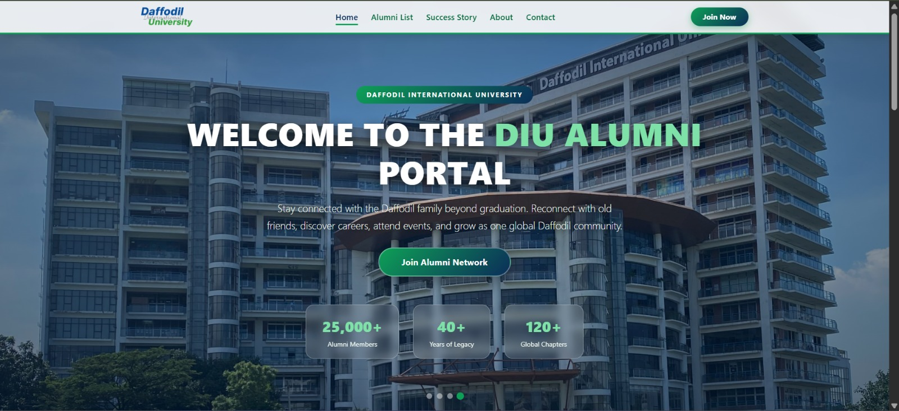
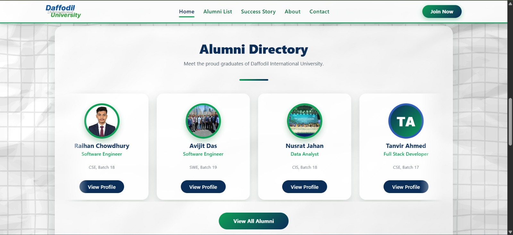
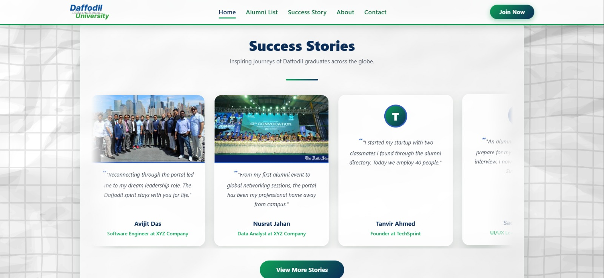
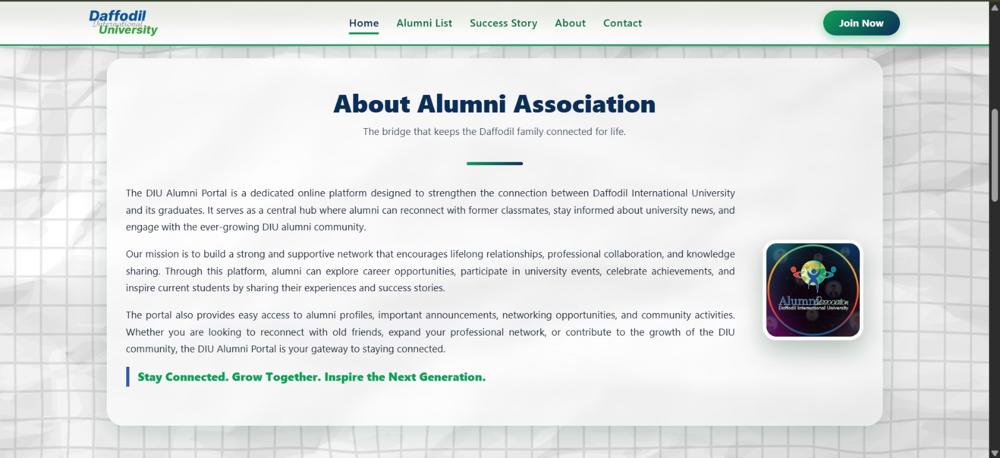

# DIU Alumni Portal
A modern and responsive alumni management portal designed to connect DIU alumni, students, and the university community.
## 🌐 Live Demo

**Comming Soon**

## About the Project

The **DIU Alumni Portal** is a web-based project developed for **Daffodil International University (DIU)** with the goal of creating a digital platform that brings alumni, students, and the university community closer together.

The portal provides a centralized and organized platform for discovering alumni, exploring career opportunities, viewing alumni success stories, learning about upcoming events, and accessing important university-related information.

The project focuses on delivering a **modern, clean, responsive, and accessible user interface** that works smoothly across desktop, tablet, and mobile devices.

> **Note:** This is a student-developed project created for educational and portfolio purposes and is not an official Daffodil International University website.

---

## Key Features

* Modern and responsive homepage
* Alumni Directory
* Alumni search and filtering
* Alumni Success Stories
* Career Opportunities
* Alumni Events
* University information
* Fully responsive design
* Contact and communication section
* Modern and user-friendly UI
* Easy and intuitive navigation

---

## Screenshots

### Homepage



### Alumni Directory



### Alumni Success Stories



### About Section



---

## Technologies Used

* **HTML5** — Website structure and semantic markup
* **CSS3** — Styling and responsive layouts
* **JavaScript** — Interactive functionality
* **Bootstrap** — Responsive UI components and layout
* **Responsive Web Design** — Cross-device compatibility

---

## 📂 Project Structure

```text
DIU-Alumni-Portal/
│
├── assets/
│   └── screenshots/
│       ├── homepage.png
│       ├── alumni-directory.png
│       ├── success-stories.png
│       ├── career.png
│       └── events.png
│
├── css/
├── js/
├── images/
│
├── index.html
├── about.html
└── README.md
```

---

## Getting Started

### 1. Clone the Repository

```bash
git clone YOUR_GITHUB_REPOSITORY_URL
```

### 2. Navigate to the Project Directory

```bash
cd DIU-Alumni-Portal
```

### 3. Run the Project

This project is built using HTML, CSS, JavaScript, and Bootstrap.

You can simply open:

```text
index.html
```

in your web browser.

For a better development experience, use **Visual Studio Code with the Live Server extension**.

---

## Project Objectives

The main objectives of the DIU Alumni Portal are:

* To create a centralized digital platform for DIU alumni
* To strengthen communication between alumni, students, and the university
* To showcase alumni achievements and success stories
* To provide career-related information and opportunities
* To promote alumni engagement and networking
* To provide easy access to alumni-related information
* To demonstrate modern and responsive web development practices

---

##  Responsive Design

The portal is designed to provide a consistent and optimized experience across different screen sizes:

*  Desktop
*  Mobile
*  Tablet

The layout, navigation, content, and components are optimized to adapt to different devices.

---

## Project Context

**Developed for:**
Daffodil International University (DIU)

**Project Type:**
Academic / Educational Web Development Project

**Purpose:**
To design and develop a modern alumni portal concept that can improve alumni engagement, networking, and communication within the university community.

---

## Developer

### Raihan Chowdhury Nibir

**Computing and Information Systems (CIS),**
**Daffodil International University**

---

## 📄 License

This project is developed for **educational and portfolio purposes**.

You are welcome to explore the source code and use it as a reference for learning and development.

